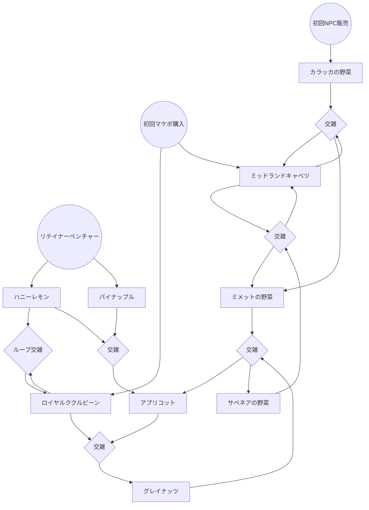

```mermaid
    graph TB;
        n((初回NPC販売))--> カラッカの野菜;
        r((リテイナーベンチャー))--> ハニーレモン;
        r((リテイナーベンチャー))--> パイナップル;
        o((初回マケボ購入))--> ロイヤルククルビーン;
        o((初回マケボ購入))--> ミッドランドキャベツ;
        ロイヤルククルビーン --> e;
        ハニーレモン--> e;
        e{ループ交雑}--> ロイヤルククルビーン;
        パイナップル--> d;
        ハニーレモン--> d;
        d{交雑}--> アプリコット;
        アプリコット--> c;
        ロイヤルククルビーン--> c;
        c{交雑}--> グレイナッツ;
        ミッドランドキャベツ--> b;
        カラッカの野菜--> b;
        b{交雑}--> ミッドランドキャベツ;
        b{交雑}--> ミメットの野菜;
        グレイナッツ--> a;
        ミメットの野菜--> a;
        a{交雑}--> アプリコット;
        a{交雑}--> サベネアの野菜;
        サベネアの野菜--> f;
        ミッドランドキャベツ--> f;
        f{交雑}--> ミッドランドキャベツ;
        f{交雑}--> ミメットの野菜;
```